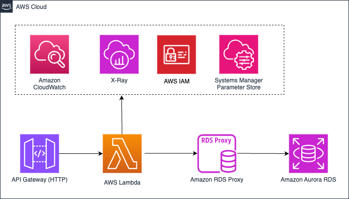
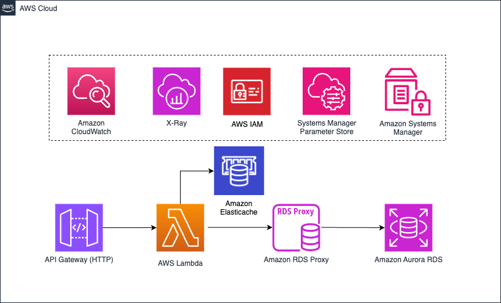

# AWS Lambda performance tuning

## Introduction

The genesis for this solution was based on a Chalk Talk for re:invent 2023 -
SVS319 AWS Lambda performance tuning: Best practices and guidance.  Our goal is
to take an already good API and make it great.

Our focus is to create an optimized solution for a maximum number of transactions per second (TPS) using Lambda.

The solution idea/starting point was from [Serverless
Land](https://serverlessland.com/patterns/apigw-http-api-lambda-rds-proxy-cdk)
which was a very basic solution for reading/writing records from an Aurora RDS.
Using the very popular ORM (Object Relational Mapping)
[sequelize](https://sequelize.org/) library, allowed Lambda to
connect to Aurora RDS via RDS Proxy, write a list of  NFL stadiums from a JSON file or read
from the datbase. This was all invoked by an Amazon API Gatweay (HTTP), and
deployed via CDK as Infrastrucure as Code (IaaC).  We refer to this as the
unoptimized soltuion. This solution on average took ~250ms to execute.
After making a few key changes to update the solution, optmized
solution, where the execution time is now ~9ms.  

## More Details

if you are interested to learn more about the thought process behind the decisions listed below, we highly encourage to read the related [blog post](https://community.aws/posts/improved-lambda-warm-start-speed-95) to this example

## Pre-requisites

- [Node.js](https://nodejs.org/en/download/)
- [AWS CLI](https://aws.amazon.com/cli/)
- [AWS CDK](https://aws.amazon.com/cdk/)

## Deploying the solutions
Wnat to deploy this for yourself?  With CDK, this is very easy.  You will find
two diretories, optimized and unoptimized. You'll need to deploy each solution
seprately. 

### Deployment commands
* `cdk bootstrap`   bootstrap your environment with CDK
* `cdk deploy --all`      deploy this stack to your default AWS account/region

## Unoptimized Solution

 
The unoptimized solution, contains the following:

* sequlize ORM library for conecting to PostgresSQL (Amazon Aurora Postgres)
* AWS SDK
* RDS Proxy
* Runtime: NodeJS 18 with TypeScript
* Parameter Store for storing parameters
* Calling AWS SDK during runtime
* x86 architecture
* 256MB memory size

## Optimized Solution

The optimized solution, contains the following:

* Postgres.js library for conecting to PostgresSQL (Amazon Aurora Postgres)
* RDS Proxy
* Runtime: NodeJS 18 with TypeScript
* Parameter Store for storing parameters
* Retrieving parameters through a Lambda extension
* Amazon ElastiCache
* Graviton 2 architecture
* 1024MB memory size

## Deleting the Solution
To delete the stacks via AWS Console follow these instructions:

1. Open the CloudFormation Console page and choose the relevant stack, then choose "Delete"
2. Once the confirmation modal appears, choose "Delete stack".
3. Wait for the CloudFormation stack to finish updating. Completion is indicated when the "Stack status" is "DELETE_COMPLETE"

## License
This library is licensed under the MIT-0 License. See the LICENSE file.