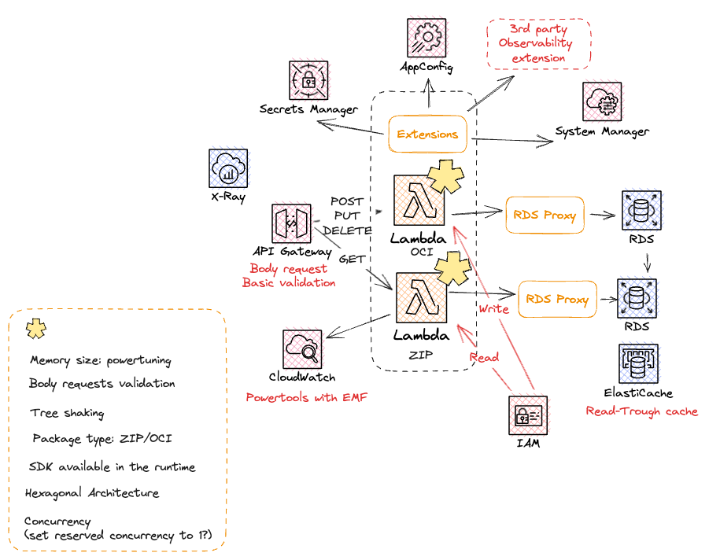
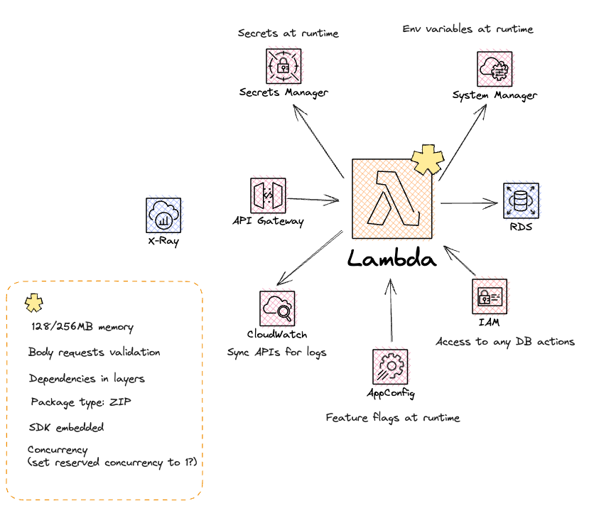

# AWS Lambda performance tuning: Best practices and guidance
This repo is broken into two parts.  The first example (located in the
unoptimized folder) is related to an simple application, a Lambda
writing/reading data from a Amazon Aurora RDS Postgres Database. 
The second example (located in in the optimized folder) has a few more bells and
whistles. This app is the same Lambda, but now it interacts with the Amazon
Aurora RDS Postgres Database by way of a RDS Proxy to manage the connections.  

## Useful commands
* `npm run build`   install the dependencies 
* `cdk deploy`      deploy this stack to your default AWS account/region

## Optimized Application

## Unoptimized Application

## Interesting reading on pooling and Sequelize
There are a few observations that our team idenfied while running the code 
https://sequelize.org/docs/v6/other-topics/aws-lambda/

